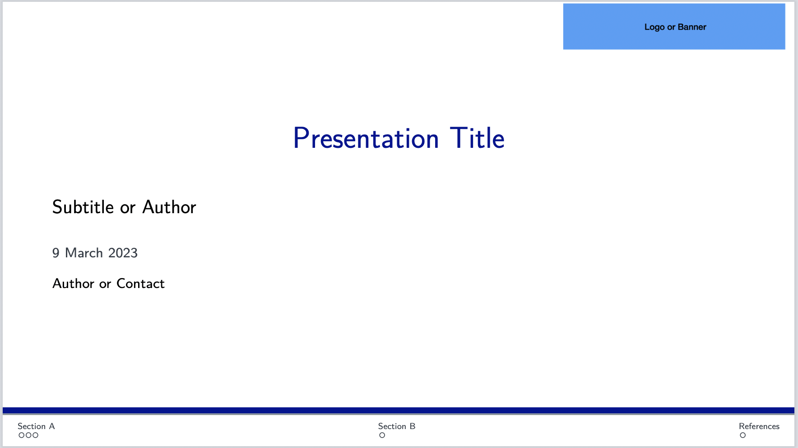
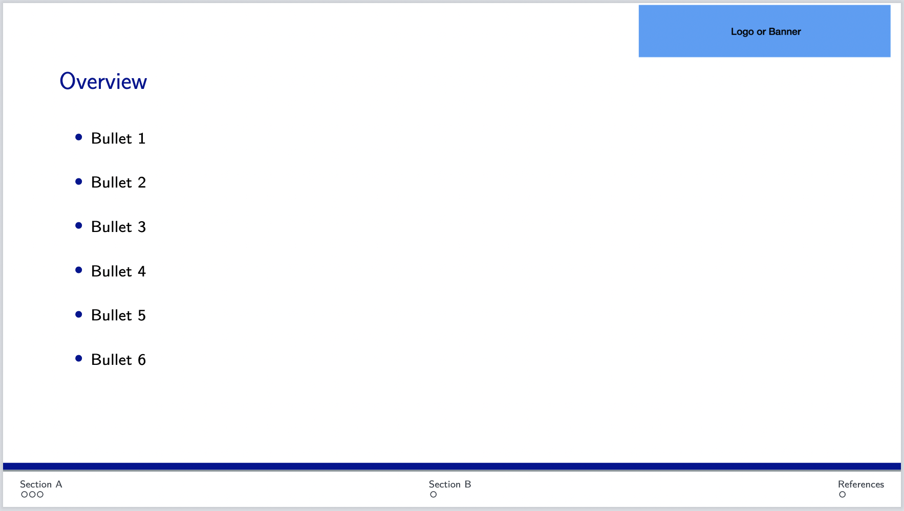
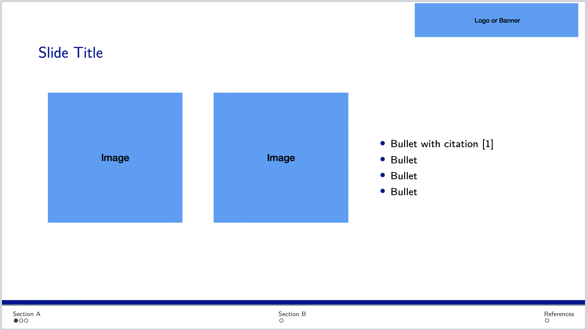
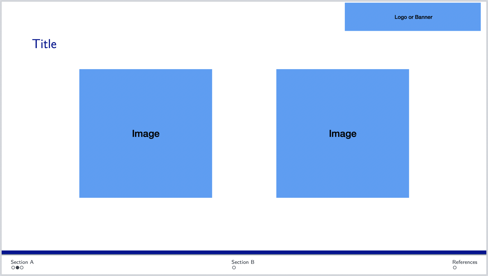
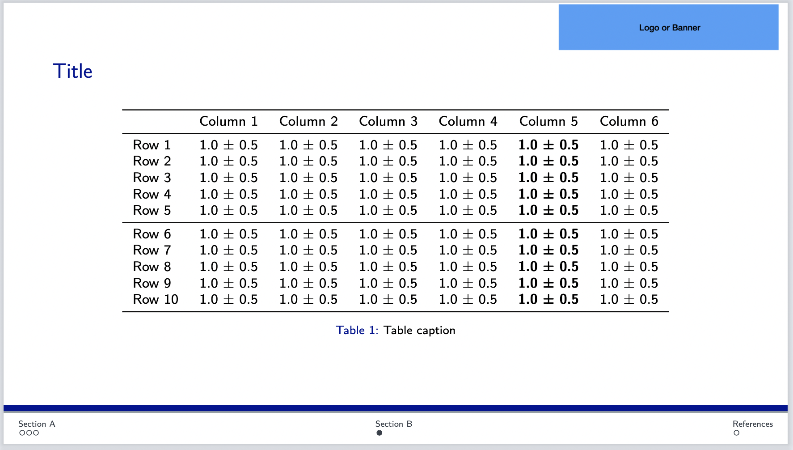
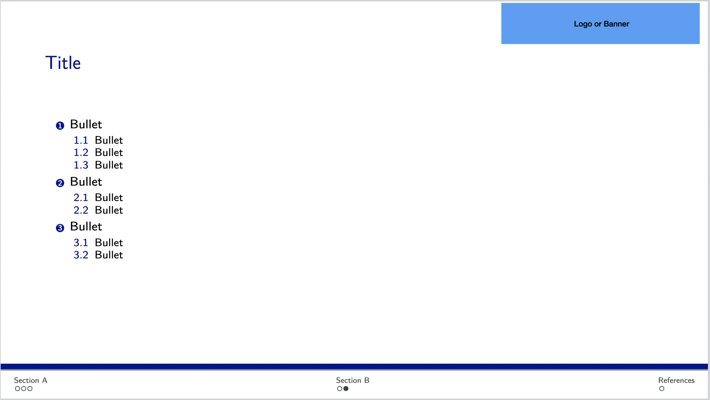
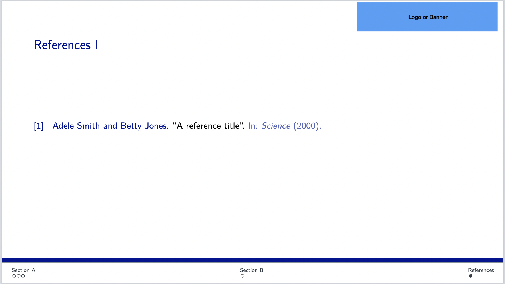

# latex-beamer-template
Template for compiling slides in latex.

This is a latex beamer template for compiling academic presentations. 
The current colour theme matches University of Oxford colours, but these can be adjusted in the *.sty file. 

This template is designed to be compiled in Overleaf but it can be compiled locally if the relevant packages are installed. 

Wide and narrow templates are supported, and the template includes examples of figures, side-by-side figures and bullet points and tables. 

## Usage

1. Download this repository as a *.zip file (Code > Download as .zip)
2. In [Overleaf](https://www.overleaf.com/project) select New Project > Upload a project > Upload the repository zip file
3. Enjoy making slides with latex! 

## Examples

